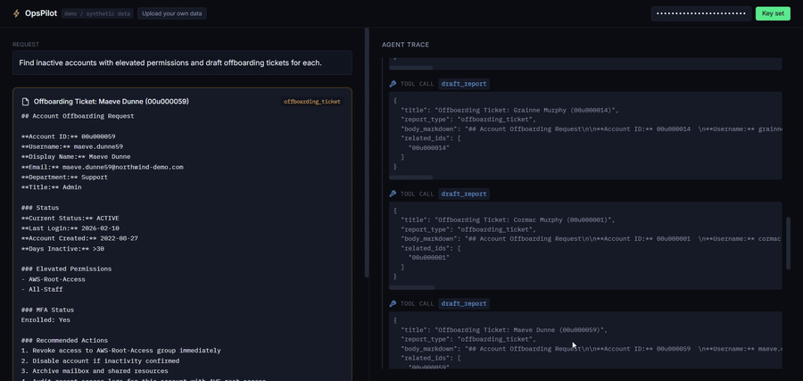
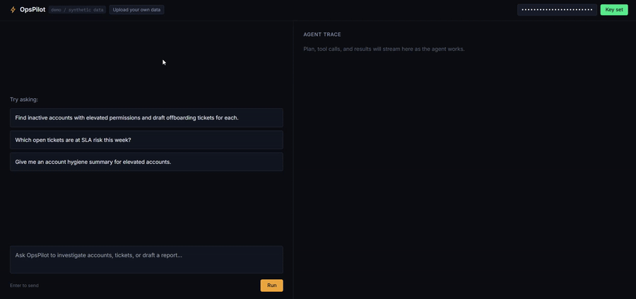

# OpsPilot

[](https://github.com/Ciaran11221/opspilot/actions/workflows/ci.yml)

**An agentic IT-operations assistant with a live tool-use trace panel.**

Ask it to find risky accounts or triage tickets, and watch it work the
problem in real time — plan, tool call, result, next step — instead of a
spinner. Runs against a bundled synthetic dataset out of the box, or your
own uploaded CSV.

A standalone interview/portfolio demo, not a production deployment — see
[Honesty notes](#honesty-notes).

## What it does

Ask it things like:

- *"Find inactive accounts with elevated permissions and draft offboarding tickets for each."*
- *"Which open tickets are at SLA risk this week?"*

It queries an account directory and a ticket queue, reasons about what it
finds, and can draft a report or offboarding-ticket artifact as a final
output.





## Features

- Real tool use — the model picks from three tools (`query_accounts`,
  `query_tickets`, `draft_report`) and chains calls as needed, not a
  scripted demo.
- Live agent trace panel, streamed over SSE — plan, tool call, result,
  final answer, all visible as they happen.
- CSV upload with automatic column mapping, date/status/priority
  normalization, and transparent warnings for anything it can't confidently
  parse (see below).
- Zero-install frontend (plain HTML, React/Tailwind via CDN, no Node build).
- Closes itself down cleanly when the demo browser tab closes.
- Packaged as a standalone Windows `.exe` — double-click, no Python install
  needed on the demo machine.
- 67 automated tests and a CI pipeline (below) — this isn't just demo-day
  code, it's held to the same bar as anything shipped for real.

## Getting started

**Prerequisites:** Python 3.10+, an Anthropic API key.

```bash
git clone https://github.com/Ciaran11221/opspilot.git
cd opspilot/backend
pip install -r requirements.txt
python -m uvicorn main:app --reload --port 8420
```

Open `http://localhost:8420`, paste in your API key, and try one of the
example prompts above.

On Windows, you can also just double-click `start_opspilot.bat` at the repo
root — it opens the browser and shuts the server down automatically when
the tab closes. Or grab the packaged `.exe` (see [Packaging](#packaging-as-a-standalone-exe)
below) for a no-terminal, no-Python demo machine.

**Config (optional):**

| Env var | Default | Purpose |
|---|---|---|
| `OPSPILOT_MODEL` | `claude-haiku-4-5-20251001` | Swap models, e.g. `claude-sonnet-5` for a live demo |
| `OPSPILOT_AUTO_SHUTDOWN` | off | Set to `1` to shut down on tab close (set automatically by the `.bat` launcher) |

## Uploading your own data

Click **"Upload your own data"** and choose a CSV — column names, date
formats, and status/priority wording don't need to match any fixed schema.
OpsPilot matches columns automatically (exact match, then fuzzy fallback),
normalizes dates/statuses/priorities, and shows you exactly what it matched
with a confidence level per field. Anything it can't confidently parse is
flagged, not guessed. Try it with the sample files in
`backend/sample_uploads/`.

## Testing

```bash
cd opspilot
pip install -r backend/requirements-dev.txt
pytest              # 67 tests, mocked API calls, runs in under 2 seconds
ruff check backend/  # lint
```

The suite covers the CSV normalization logic (messy headers, mixed date
formats, unrecognized vocabularies), the tool implementations
(`query_accounts`/`query_tickets`/`draft_report` filtering and edge cases),
every HTTP route in `main.py`, and the agent loop's control flow (tool-call
sequencing, the `MAX_TURNS` cutoff, error handling) — all against a mocked
Anthropic client, so it's free and fast enough to run on every push. CI
(badge above) runs this on Python 3.10 and 3.12 for every push and PR.

**What this test suite is *not*:** it doesn't test whether the model picks
the *correct* tool for a given prompt — that requires calling the real
model, not mocking it. That's what the eval harness below is for.

## Evals

`backend/evals/` measures actual model behavior against a small,
hand-curated set of scenarios — does the agent reach for the right tool(s)
for a given request, and complete without erroring:

```bash
export ANTHROPIC_API_KEY=sk-...
python backend/evals/run_evals.py
python backend/evals/run_evals.py --model claude-sonnet-5 --verbose
```

This calls the real Claude API and costs a small amount (a fraction of a
cent per scenario on Haiku), so it's run manually — after changing the
system prompt, tool descriptions, or model — rather than on every commit.
See `backend/evals/scenarios.py` for the scenario definitions and what
"correct" means for each one.

## Architecture

```
opspilot/
  start_opspilot.bat        Double-click launcher for demos (Windows)
  pytest.ini                 Test config
  ruff.toml                    Lint config
  .github/workflows/ci.yml       Lint + test on every push/PR
  backend/
    main.py                 FastAPI app - routes, SSE streaming, static serving
    agent.py                 Tool-use loop against the Claude API
    tools.py                  Tool implementations
    csv_ingest.py               CSV -> normalized schema
    dataset_store.py             In-memory registry for uploaded datasets
    launcher.py                 Entry point for the packaged .exe
    requirements-dev.txt          Test/lint dependencies (pytest, ruff, httpx)
    data/                         Synthetic dataset + generator
    sample_uploads/                Messy test CSVs
    tests/                          Unit tests (mocked API, runs in CI)
    evals/                           Behavioral evals (real API, run manually)
  frontend/
    dist/index.html          Static frontend (React/Tailwind via CDN)
docs/
  DESIGN.md                 Deeper notes: full request flow, design
                             rationale, known limitations, testing
```

For the full request-flow diagram, design rationale, known limitations, and
what's actually been tested, see **[docs/DESIGN.md](docs/DESIGN.md)**.

## Honesty notes

- **All bundled data is synthetic** — generated by `backend/data/generate_data.py`,
  seeded for reproducible demo results. No real organization's data.
- **No live business access** — this has never connected to a real Okta,
  M365, or Jira tenant. CSV upload reads a local file only.
- **The agent loop is Claude's native tool-use loop, made visible** — not a
  custom multi-agent framework.
- **`draft_report` produces a draft only** — nothing is ever submitted to a
  real system.
- **Performance claims are scoped to the seeded synthetic dataset**, never
  framed as production/real-world figures.
- **The test suite mocks the Claude API**; it verifies the code around the
  model (routing, filtering, error handling), not the model's own behavior.
  The eval harness is the layer that checks actual model behavior, and it's
  a small, hand-curated set of scenarios — not a claim of broad coverage.

## Packaging as a standalone .exe

```bash
pip install pyinstaller
pyinstaller --onefile --distpath exe-dist --add-data "frontend/dist;frontend/dist" --add-data "backend/data;data" backend/launcher.py
```

Run it from the repo root (paths above are relative to it). Output lands in
`exe-dist/launcher.exe` — `--distpath exe-dist` keeps PyInstaller's build
output separate from `frontend/dist`, which is a different folder entirely.

## Known limitations

Things this project deliberately doesn't solve, since they're outside its
scope as a portfolio/interview demo rather than oversights:

- **No persistence across server restarts** — uploaded datasets live in
  memory only (`dataset_store.py`). Restarting the server loses them. A real
  deployment would need a database, not an in-memory dict.
- **Single-process, not built for concurrent users** — fine for a one-person
  demo; would need per-session isolation and a real datastore to support
  multiple people using it at once.
- **Query results cap at 10 records in detail** (`tools.py`) to avoid the
  model exceeding its output budget mid-response when a lot of records
  match. This is a deliberate tradeoff, not a bug - see the note in `tools.py`
  for why, and the regression test in `test_agent.py` for what happens
  without it.
- **No retry/backoff on Anthropic API errors** — a transient API failure
  surfaces as an error in the trace panel rather than automatically retrying.
- **The eval harness is 6 hand-picked scenarios**, not a large or randomized
  benchmark — enough to catch a regression in obvious tool-selection
  behavior, not a claim of statistical coverage.

## Roadmap

- [x] Automated test suite (pytest, mocked API, CI on every push)
- [x] Eval harness for actual model tool-selection behavior
- [x] PyInstaller build + smoke test on Windows
- [x] Demo GIFs in this README

## License

MIT — see [LICENSE](LICENSE).